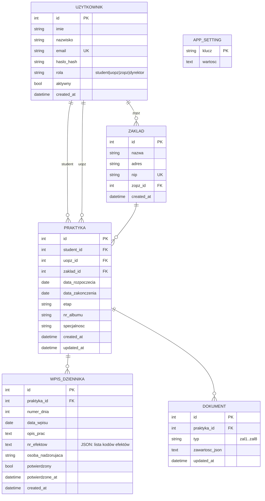

## Uwagi

- **Role** użytkownika: `student`, `uopz` (uczelniany opiekun), `zopz` (zakładowy opiekun),
  `dyrektor`. Administrator nie jest kontem użytkownika — to panel `/admin` chroniony hasłem
  (hash w tabeli `APP_SETTING`, klucz `admin_password_hash`).
- **ZAKLAD.zopz_id** wskazuje użytkownika z rolą `zopz`, który jest opiekunem zakładowym.
- **PRAKTYKA.etap** — stan w 13-etapowym workflow (np. `dyrektor_wysyla_wstepne`,
  `dziennik_aktywny`, `zamknieta`); zmienia się automatycznie po podpisaniu dokumentów.
- **DOKUMENT** — jeden wiersz na (praktyka, typ); cała treść załącznika trzymana jest jako
  JSON w `zawartosc_json` (pola formularzy i podpisy). Unikalność: `(praktyka_id, typ)`.
- **WPIS_DZIENNIKA** — 120 wpisów na praktykę (`UNIQUE(praktyka_id, numer_dnia)`),
  grupowane po 10 w strony zatwierdzane przez ZOPZ. `nr_efektow` to lista kodów efektów
  zapisana jako JSON. Kolumna `osoba_nadzorujaca` pozostaje w schemacie, ale nie jest
  już używana w interfejsie.
- **Efekty uczenia się** (E01–E13) nie są osobną tabelą — to stała lista w kodzie
  (`EFEKTY_UCZENIA` w `api/db.py`).
- **APP_SETTING** — ustawienia aplikacji typu klucz/wartość (m.in. hash hasła administratora).
```
