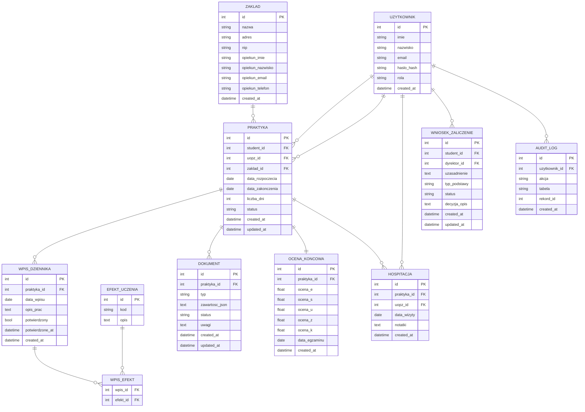

```mermaid
erDiagram
    UZYTKOWNIK {
        int id PK
        string imie
        string nazwisko
        string email
        string haslo_hash
        string rola
        datetime created_at
    }

    ZAKLAD {
        int id PK
        string nazwa
        string adres
        string nip
        string opiekun_imie
        string opiekun_nazwisko
        string opiekun_email
        string opiekun_telefon
        datetime created_at
    }

    PRAKTYKA {
        int id PK
        int student_id FK
        int uopz_id FK
        int zaklad_id FK
        date data_rozpoczecia
        date data_zakonczenia
        int liczba_dni
        string status
        datetime created_at
        datetime updated_at
    }

    WPIS_DZIENNIKA {
        int id PK
        int praktyka_id FK
        date data_wpisu
        text opis_prac
        bool potwierdzony
        datetime potwierdzone_at
        datetime created_at
    }

    WPIS_EFEKT {
        int wpis_id FK
        int efekt_id FK
    }

    EFEKT_UCZENIA {
        int id PK
        string kod
        text opis
    }

    DOKUMENT {
        int id PK
        int praktyka_id FK
        string typ
        text zawartosc_json
        string status
        text uwagi
        datetime created_at
        datetime updated_at
    }

    OCENA_KONCOWA {
        int id PK
        int praktyka_id FK
        float ocena_e
        float ocena_s
        float ocena_u
        float ocena_z
        float ocena_k
        date data_egzaminu
        datetime created_at
    }

    HOSPITACJA {
        int id PK
        int praktyka_id FK
        int uopz_id FK
        date data_wizyty
        text notatki
        datetime created_at
    }

    WNIOSEK_ZALICZENIE {
        int id PK
        int student_id FK
        int dyrektor_id FK
        text uzasadnienie
        string typ_podstawy
        string status
        text decyzja_opis
        datetime created_at
        datetime updated_at
    }

    AUDIT_LOG {
        int id PK
        int uzytkownik_id FK
        string akcja
        string tabela
        int rekord_id
        datetime created_at
    }

    UZYTKOWNIK ||--o{ PRAKTYKA : ""
    UZYTKOWNIK ||--o{ PRAKTYKA : ""
    ZAKLAD ||--o{ PRAKTYKA : ""
    PRAKTYKA ||--o{ WPIS_DZIENNIKA : ""
    WPIS_DZIENNIKA ||--o{ WPIS_EFEKT : ""
    EFEKT_UCZENIA ||--o{ WPIS_EFEKT : ""
    PRAKTYKA ||--o{ DOKUMENT : ""
    PRAKTYKA ||--|| OCENA_KONCOWA : ""
    PRAKTYKA ||--o{ HOSPITACJA : ""
    UZYTKOWNIK ||--o{ HOSPITACJA : ""
    UZYTKOWNIK ||--o{ WNIOSEK_ZALICZENIE : ""
    UZYTKOWNIK ||--o{ AUDIT_LOG : ""
```