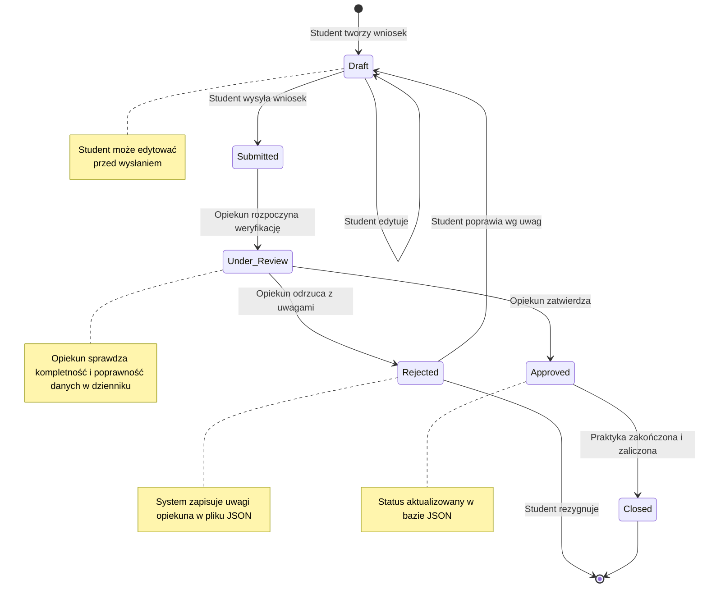

```mermaid
stateDiagram-v2
    [*] --> Draft : Student tworzy wniosek

    Draft --> Submitted : Student wysyła wniosek
    Draft --> Draft : Student edytuje

    Submitted --> Under_Review : Opiekun rozpoczyna weryfikację

    Under_Review --> Approved : Opiekun zatwierdza
    Under_Review --> Rejected : Opiekun odrzuca z uwagami

    Rejected --> Draft : Student poprawia wg uwag
    Rejected --> [*] : Student rezygnuje

    Approved --> Closed : Praktyka zakończona i zaliczona

    Closed --> [*]

    note right of Draft
        Student może edytować
        przed wysłaniem
    end note

    note right of Under_Review
        Opiekun sprawdza kompletność i poprawność danych w dzienniku
    end note

    note right of Rejected
        System zapisuje uwagi opiekuna w pliku JSON
    end note

    note right of Approved
        Status aktualizowany w bazie JSON
    end note

```