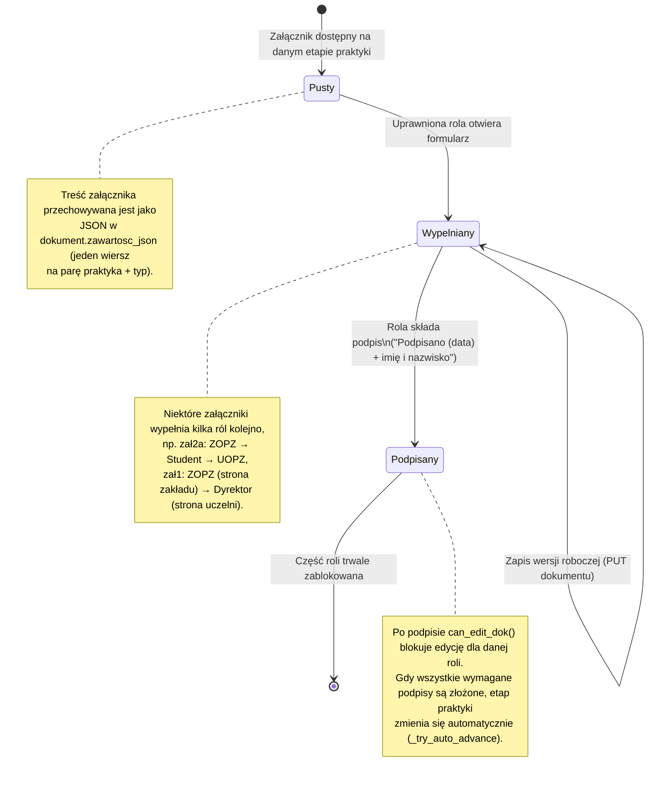

## Uwagi

- Dokument **nie ma osobnej kolumny statusu** – stan wynika z obecności podpisów
  w `zawartosc_json` oraz z bieżącego `etap` praktyki.
- Lista typów: `zal1`, `zal2`, `zal2a`, `zal3_1`..`zal3_6`, `zal4`, `zal5`, `zal7`, `zal8`.
- Każdy załącznik można pobrać jako PDF (`GET /api/praktyki/<id>/dokumenty/<typ>/pdf`).
```
