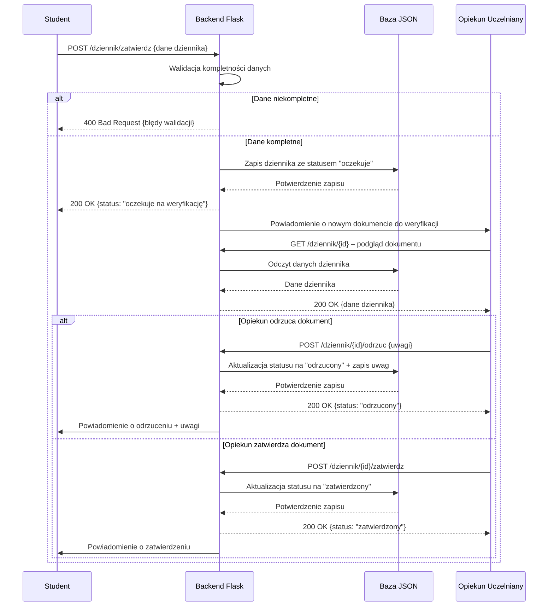

```mermaid
sequenceDiagram
    participant S as Student
    participant B as Backend Flask
    participant J as Baza JSON
    participant O as Opiekun Uczelniany

    S->>B: POST /dziennik/zatwierdz {dane dziennika}

    B->>B: Walidacja kompletności danych

    alt Dane niekompletne
        B-->>S: 400 Bad Request {błędy walidacji}
    else Dane kompletne
        B->>J: Zapis dziennika ze statusem "oczekuje"
        J-->>B: Potwierdzenie zapisu

        B-->>S: 200 OK {status: "oczekuje na weryfikację"}

        B->>O: Powiadomienie o nowym dokumencie do weryfikacji

        O->>B: GET /dziennik/{id} – podgląd dokumentu
        B->>J: Odczyt danych dziennika
        J-->>B: Dane dziennika
        B-->>O: 200 OK {dane dziennika}

        alt Opiekun odrzuca dokument
            O->>B: POST /dziennik/{id}/odrzuc {uwagi}
            B->>J: Aktualizacja statusu na "odrzucony" + zapis uwag
            J-->>B: Potwierdzenie zapisu
            B-->>O: 200 OK {status: "odrzucony"}
            B->>S: Powiadomienie o odrzuceniu + uwagi
        else Opiekun zatwierdza dokument
            O->>B: POST /dziennik/{id}/zatwierdz
            B->>J: Aktualizacja statusu na "zatwierdzony"
            J-->>B: Potwierdzenie zapisu
            B-->>O: 200 OK {status: "zatwierdzony"}
            B->>S: Powiadomienie o zatwierdzeniu
        end
    end

```