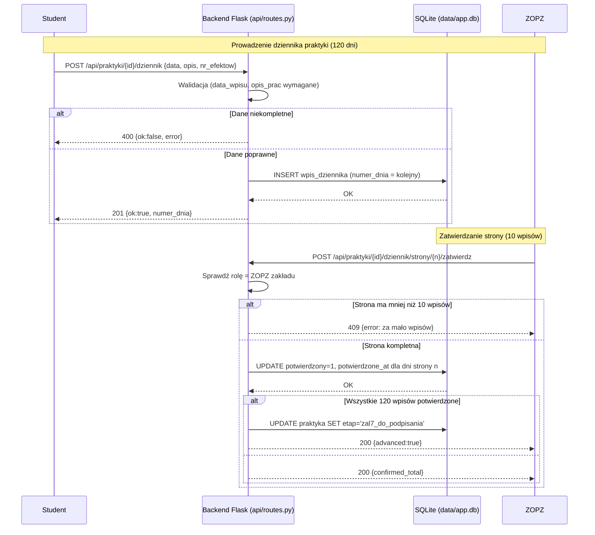

## Uwagi

- Dane przechowywane są w **SQLite** (`data/app.db`), nie w plikach JSON.
- Dziennik liczy **120 wpisów** pogrupowanych w **12 stron po 10 dni**; ZOPZ zatwierdza
  całą stronę naraz (podpis ZOPZ pojawia się na zatwierdzonej stronie PDF).
- Po potwierdzeniu wszystkich 120 wpisów etap praktyki przechodzi automatycznie do
  `zal7_do_podpisania` (mechanizm także samonaprawiający przy wczytaniu praktyki).
- Stronę niezatwierdzoną student może jeszcze edytować
  (`PUT /api/praktyki/{id}/dziennik/{numer}`).
```
