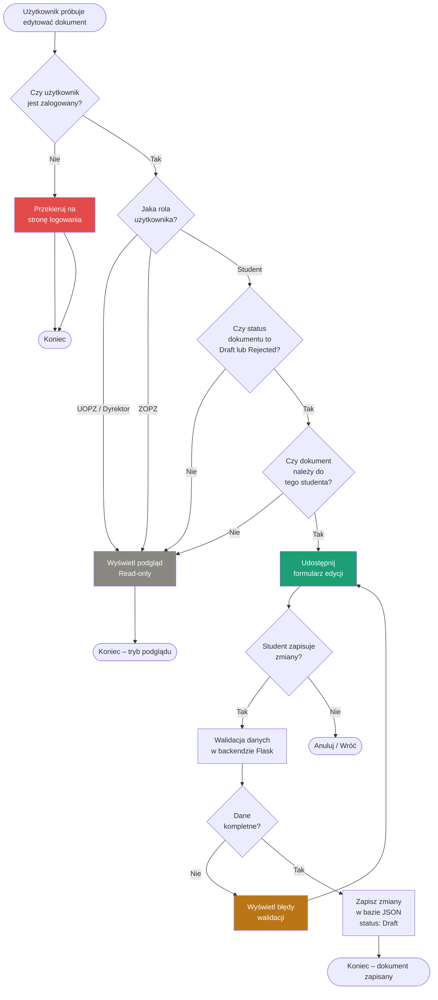

```mermaid
flowchart TD
    A([Użytkownik próbuje edytować dokument]) --> B{Czy użytkownik\njest zalogowany?}

    B -- Nie --> C[Przekieruj na\nstronę logowania]
    C --> KONIEC1([Koniec])

    B -- Tak --> D{Jaka rola\nużytkownika?}

    D -- UOPZ / Dyrektor --> E[Wyświetl podgląd\nRead-only]
    D -- ZOPZ --> E
    D -- Student --> F{Czy status\ndokumentu to\nDraft lub Rejected?}

    F -- Nie --> E

    F -- Tak --> G{Czy dokument\nnależy do\ntego studenta?}

    G -- Nie --> E
    G -- Tak --> H[Udostępnij\nformularz edycji]

    H --> I{Student zapisuje\nzmiany?}
    I -- Tak --> J[Walidacja danych\nw backendzie Flask]
    I -- Nie --> KONIEC2([Anuluj / Wróć])

    J --> L{Dane\nkompletne?}
    L -- Nie --> M[Wyświetl błędy\nwalidacji]
    M --> H
    L -- Tak --> N[Zapisz zmiany\nw bazie JSON\nstatus: Draft]
    N --> KONIEC3([Koniec – dokument zapisany])

    E --> KONIEC4([Koniec – tryb podglądu])
    C --> KONIEC1

    style H fill:#1D9E75,color:#fff
    style E fill:#888780,color:#fff
    style C fill:#E24B4A,color:#fff
    style M fill:#BA7517,color:#fff

```