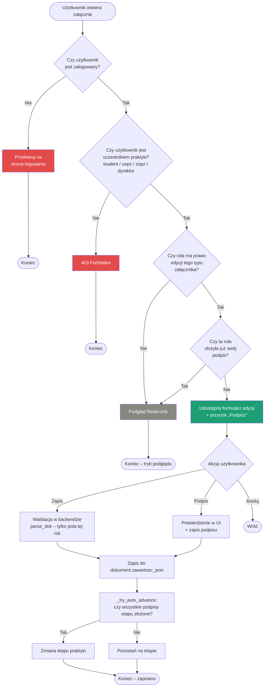

## Uwagi

- Uprawnienia wyznacza funkcja **`can_edit_dok(typ, praktyka, user, dok_data)`** w `api/db.py`:
  sprawdza udział w praktyce, dopasowanie roli do typu załącznika oraz to, czy rola już
  podpisała (po podpisie część dokumentu jest trwale zablokowana).
- Zapis przechodzi przez **`parse_dok()`**, który aktualizuje wyłącznie pola należące do roli
  bieżącego użytkownika (np. ZOPZ wypełnia efekty zał4, UOPZ – opinię).
- Po każdym zapisie sprawdzane jest, czy etap praktyki może zmienić się automatycznie.
```
