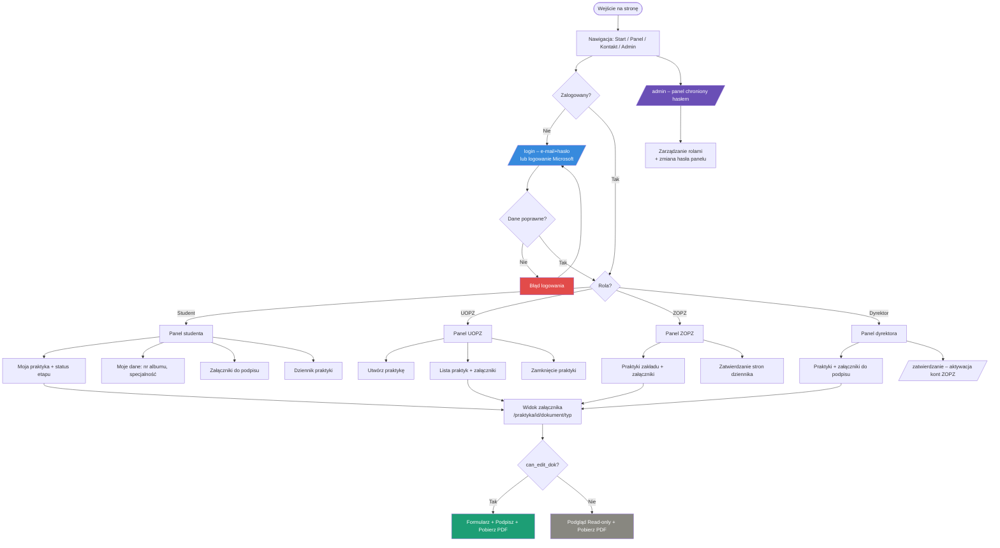

## Uwagi

- Pasek nawigacji (`base.html`): **Start, Panel, Kontakt, Admin** oraz – po zalogowaniu –
  **Profil, Wyloguj** (a dla dyrektora dodatkowo **Zatwierdzanie**). W trybie demo dostępny
  jest też dropdown **🛠 DEV** z szybkim logowaniem na konta testowe.
- Panel (`/dashboard`) renderuje się zależnie od roli (jeden szablon `dashboard.html`).
- Załączniki obsługiwane są jednym widokiem `dokument.html` (gałąź `if/elif` per typ),
  z możliwością pobrania PDF.
- Panel administratora (`/admin`) jest niezależny od kont użytkowników – chroniony samym hasłem.
```
