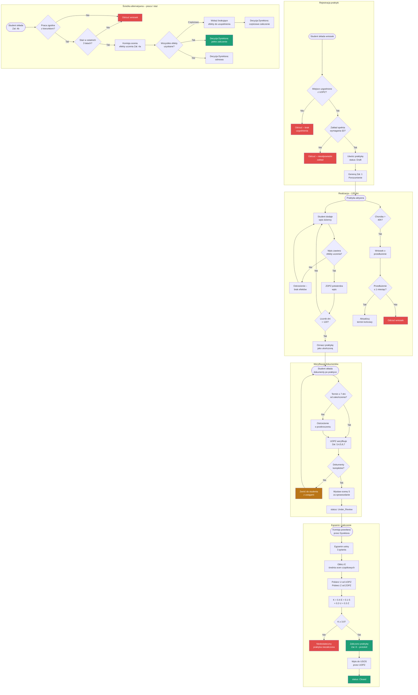

```mermaid
flowchart TD
    subgraph REJESTRACJA [Rejestracja praktyki]
        A1([Student składa wniosek]) --> A2{Miejsce uzgodnione\nz UOPZ?}
        A2 -- Nie --> A3[Odrzuć – brak\nuzgodnienia]
        A2 -- Tak --> A4{Zakład spełnia\nwymagania §3?}
        A4 -- Nie --> A5[Odrzuć – nieodpowiedni\nzakład]
        A4 -- Tak --> A6[Utwórz praktykę\nstatus: Draft]
        A6 --> A7[Generuj Zał. 1\nPorozumienie]
    end

    subgraph REALIZACJA [Realizacja – 120 dni]
        B1([Praktyka aktywna]) --> B2[Student dodaje\nwpis dzienny]
        B2 --> B3{Wpis zawiera\nefekty uczenia?}
        B3 -- Nie --> B4[Ostrzeżenie –\nbrak efektów]
        B4 --> B2
        B3 -- Tak --> B5[ZOPZ potwierdza\nwpis]
        B5 --> B6{Licznik dni\n= 120?}
        B6 -- Nie --> B2
        B6 -- Tak --> B7[Oznacz praktykę\njako ukończoną]

        B1 --> B8{Choroba >\n40h?}
        B8 -- Tak --> B9[Wniosek o\nprzedłużenie]
        B9 --> B10{Przedłużenie\n≤ 1 miesiąc?}
        B10 -- Tak --> B11[Aktualizuj\ntermin końcowy]
        B10 -- Nie --> B12[Odrzuć wniosek]
    end

    subgraph WERYFIKACJA [Weryfikacja dokumentów]
        C1([Student składa\ndokumenty po praktyce]) --> C2{Termin ≤ 7 dni\nod zakończenia?}
        C2 -- Nie --> C3[Ostrzeżenie\no przekroczeniu]
        C2 -- Tak --> C4[UOPZ weryfikuje\nZał. 3,4,5,6,7]
        C3 --> C4
        C4 --> C5{Dokumenty\nkompletne?}
        C5 -- Nie --> C6[Zwróć do studenta\nz uwagami]
        C6 --> C1
        C5 -- Tak --> C7[Wystaw ocenę S\nza sprawozdanie]
        C7 --> C8[status: Under_Review]
    end

    subgraph EGZAMIN [Egzamin i zaliczenie]
        D1([Komisja powołana\nprzez Dyrektora]) --> D2[Egzamin ustny\n3 pytania]
        D2 --> D3[Oblicz E\nśrednia ocen cząstkowych]
        D3 --> D4[Pobierz U od UOPZ\nPobierz Z od ZOPZ]
        D4 --> D5[K = 0.4·E + 0.1·S\n+ 0.2·U + 0.3·Z]
        D5 --> D6{K ≥ 3.0?}
        D6 -- Nie --> D7[Niedostateczny\npraktyka niezaliczona]
        D6 -- Tak --> D8[Zaliczono praktykę\nZał. 8 – protokół]
        D8 --> D9[Wpis do USOS\nprzez UOPZ]
        D9 --> D10[status: Closed]
    end

    subgraph ALTERNATYWNA [Ścieżka alternatywna – praca / staż]
        E1([Student składa\nZał. 4b]) --> E2{Praca zgodna\nz kierunkiem?}
        E2 -- Nie --> E3[Odrzuć wniosek]
        E2 -- Tak --> E4{Staż w ostatnich\n3 latach?}
        E4 -- Nie --> E3
        E4 -- Tak --> E5[Komisja ocenia\nefekty uczenia Zał. 4a]
        E5 --> E6{Wszystkie efekty\nuzyskane?}
        E6 -- Częściowo --> E7[Wskaż brakujące\nefekty do uzupełnienia]
        E7 --> E8[Decyzja Dyrektora:\nczęściowe zaliczenie]
        E6 -- Tak --> E9[Decyzja Dyrektora:\npełne zaliczenie]
        E6 -- Nie --> E10[Decyzja Dyrektora:\nodmowa]
    end

    A7 --> B1
    B7 --> C1
    C8 --> D1

    style A3 fill:#E24B4A,color:#fff
    style A5 fill:#E24B4A,color:#fff
    style B12 fill:#E24B4A,color:#fff
    style C6 fill:#BA7517,color:#fff
    style D7 fill:#E24B4A,color:#fff
    style E3 fill:#E24B4A,color:#fff
    style D10 fill:#1D9E75,color:#fff
    style E9 fill:#1D9E75,color:#fff
    style D8 fill:#1D9E75,color:#fff

```