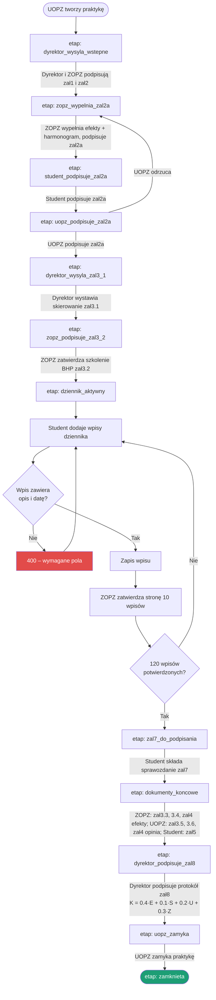

Aplikacja prowadzi praktykę przez **13-etapowy workflow** zapisany w polu `praktyka.etap`.
Etap zmienia się **automatycznie** po złożeniu wszystkich wymaganych podpisów na danym etapie
(`_try_auto_advance` w `api/routes.py`).



## Uwagi

- **Tworzenie praktyki** – tylko UOPZ; wskazuje studenta, zakład (z opiekunem ZOPZ) i termin.
- **Dane studenta** (numer albumu, specjalność) uzupełnia student w panelu; trafiają
  automatycznie do załączników 2a/3.1/4/7 i dziennika.
- **Ocena końcowa** liczona jest w protokole **zał8** (`K = 0,4·E + 0,1·S + 0,2·U + 0,3·Z`),
  gdzie S/U/Z pochodzą z ocen w załącznikach 3.4–3.6, a E ze średniej mini-zadań.
- W projekcie **nie ma** osobnej ścieżki „praca/staż” (zał4a/4b), hospitacji ani integracji
  z USOS – to elementy regulaminu papierowego, nie zaimplementowane w aplikacji.
```
