Backend to **REST API** (blueprint `api/routes.py`) operujące na **SQLite** (`data/app.db`).
Sesję użytkownika obsługuje Flask-Login (ciasteczko sesyjne), a nie tokeny JWT.
Odpowiedzi mają format `{"ok": true, "data": ...}` lub `{"ok": false, "error": ...}`.

```mermaid
flowchart TD
    REQ([Żądanie HTTP]) --> AUTH[Flask-Login: current_user]
    AUTH --> AUTHOK{Zalogowany?}
    AUTHOK -- Nie --> E401[401 / przekierowanie na /login]
    AUTHOK -- Tak --> ROUTER{Endpoint}

    ROUTER -- GET /api/praktyki --> OP_LIST
    ROUTER -- POST /api/praktyki --> OP_CREATE
    ROUTER -- POST /api/praktyki/id/dane-studenta --> OP_DANE
    ROUTER -- POST /api/praktyki/id/dziennik --> OP_WPIS
    ROUTER -- POST /api/praktyki/id/dziennik/strony/n/zatwierdz --> OP_POTW
    ROUTER -- PUT /api/praktyki/id/dokumenty/typ --> OP_DOK
    ROUTER -- POST /api/praktyki/id/akcja --> OP_AKCJA
    ROUTER -- GET .../pdf --> OP_PDF

    subgraph OP_LIST [Lista praktyk]
        L1[Filtr po roli: student / uopz / zopz / dyrektor] --> L2[SELECT z JOIN uzytkownik, zaklad]
        L2 --> L3[_enrich_praktyka: etap, statusy, liczniki]
        L3 --> L4[200 OK + lista]
    end

    subgraph OP_CREATE [Tworzenie praktyki – tylko UOPZ]
        C1{Rola = UOPZ?} -- Nie --> C2[403 Forbidden]
        C1 -- Tak --> C3[Walidacja student/zakład/termin]
        C3 --> C4[INSERT praktyka, etap startowy]
        C4 --> C5[201 Created + dane]
    end

    subgraph OP_DANE [Dane studenta]
        N1{Rola = Student\nwłaściciel?} -- Nie --> N2[403]
        N1 -- Tak --> N3[UPDATE praktyka SET nr_albumu, specjalnosc]
        N3 --> N4[200 OK]
    end

    subgraph OP_WPIS [Wpis do dziennika]
        W1{etap = dziennik_aktywny\ni rola = Student?} -- Nie --> W2[409 / 403]
        W1 -- Tak --> W3[Walidacja: data, opis]
        W3 --> W4[INSERT wpis_dziennika, numer_dnia = kolejny]
        W4 --> W5[201 Created]
    end

    subgraph OP_POTW [ZOPZ zatwierdza stronę]
        P1{Rola = ZOPZ zakładu?} -- Nie --> P2[403]
        P1 -- Tak --> P3{Strona ma 10 wpisów?}
        P3 -- Nie --> P4[409]
        P3 -- Tak --> P5[UPDATE potwierdzony=1, potwierdzone_at]
        P5 --> P6{120/120?}
        P6 -- Tak --> P7[UPDATE etap = zal7_do_podpisania]
        P6 -- Nie --> P8[200 OK]
        P7 --> P8
    end

    subgraph OP_DOK [Zapis / podpis załącznika]
        K1[can_edit_dok? rola + typ + brak podpisu] --> K2{Dozwolone?}
        K2 -- Nie --> K3[403]
        K2 -- Tak --> K4[parse_dok: pola tylko tej roli + ewentualny podpis]
        K4 --> K5[UPSERT dokument.zawartosc_json]
        K5 --> K6[_try_auto_advance: ewentualna zmiana etapu]
        K6 --> K7[200 OK]
    end

    subgraph OP_AKCJA [Akcja na etapie]
        A1[Sprawdź can_act / can_reject] --> A2{Wymagane podpisy obecne?}
        A2 -- Nie --> A3[409 + lista braków]
        A2 -- Tak --> A4[UPDATE praktyka SET etap]
        A4 --> A5[200 OK]
    end

    subgraph OP_PDF [Generowanie PDF]
        F1[Odczyt dokumentu / dziennika z DB] --> F2[reportlab: pdf_docs.py]
        F2 --> F3[200 OK – plik PDF]
    end

    style E401 fill:#E24B4A,color:#fff
    style C2 fill:#E24B4A,color:#fff
    style C5 fill:#1D9E75,color:#fff
    style F3 fill:#1D9E75,color:#fff
```



## Uwagi

- Brak JWT i plików `.json` – stan trzymany jest w tabelach SQLite
  (`uzytkownik`, `zaklad`, `praktyka`, `wpis_dziennika`, `dokument`, `app_setting`).
- Mutacje przechodzą przez REST API; warstwa webowa (`app.py`) jedynie renderuje szablony
  i obsługuje logowanie.
- Treść załączników to JSON w `dokument.zawartosc_json`; PDF-y generowane są na żądanie
  z aktualnych danych (`api/pdf_docs.py`).
```
