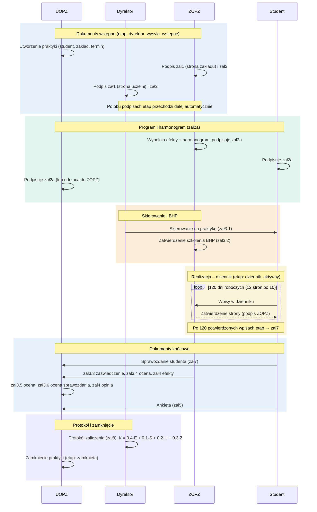

## Uwagi

- Diagram odzwierciedla **13-etapowy workflow** z pola `praktyka.etap`; przejścia następują
  automatycznie po złożeniu wymaganych podpisów.
- Oceny składowe: **S** – ocena sprawozdania (zał3.6), **U** – UOPZ (zał3.5),
  **Z** – ZOPZ (zał3.4), **E** – średnia mini-zadań w protokole (zał8).
- Role w aplikacji: student, UOPZ, ZOPZ, dyrektor; konta ZOPZ aktywuje dyrektor
  (`/zatwierdzanie`), a role nadaje administrator (`/admin`).
```
