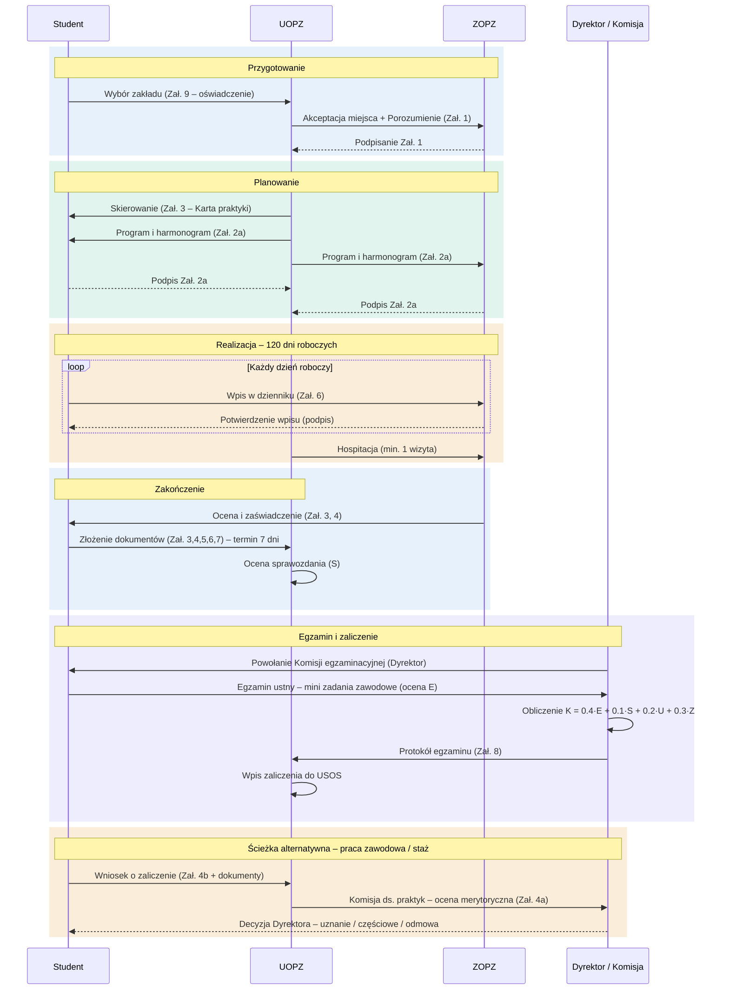

```mermaid
sequenceDiagram
    participant S as Student
    participant U as UOPZ
    participant Z as ZOPZ
    participant D as Dyrektor / Komisja

    rect rgb(230, 241, 251)
        Note over S,Z: Przygotowanie
        S->>U: Wybór zakładu (Zał. 9 – oświadczenie)
        U->>Z: Akceptacja miejsca + Porozumienie (Zał. 1)
        Z-->>U: Podpisanie Zał. 1
    end

    rect rgb(225, 245, 238)
        Note over S,Z: Planowanie
        U->>S: Skierowanie (Zał. 3 – Karta praktyki)
        U->>S: Program i harmonogram (Zał. 2a)
        U->>Z: Program i harmonogram (Zał. 2a)
        S-->>U: Podpis Zał. 2a
        Z-->>U: Podpis Zał. 2a
    end

    rect rgb(250, 238, 218)
        Note over S,Z: Realizacja – 120 dni roboczych
        loop Każdy dzień roboczy
            S->>Z: Wpis w dzienniku (Zał. 6)
            Z-->>S: Potwierdzenie wpisu (podpis)
        end
        U->>Z: Hospitacja (min. 1 wizyta)
    end

    rect rgb(230, 241, 251)
        Note over S,U: Zakończenie
        Z->>S: Ocena i zaświadczenie (Zał. 3, 4)
        S->>U: Złożenie dokumentów (Zał. 3,4,5,6,7) – termin 7 dni
        U->>U: Ocena sprawozdania (S)
    end

    rect rgb(238, 237, 254)
        Note over S,D: Egzamin i zaliczenie
        D->>S: Powołanie Komisji egzaminacyjnej (Dyrektor)
        S->>D: Egzamin ustny – mini zadania zawodowe (ocena E)
        D->>D: Obliczenie K = 0.4·E + 0.1·S + 0.2·U + 0.3·Z
        D->>U: Protokół egzaminu (Zał. 8)
        U->>U: Wpis zaliczenia do USOS
    end

    rect rgb(250, 238, 218)
        Note over S,D: Ścieżka alternatywna – praca zawodowa / staż
        S->>U: Wniosek o zaliczenie (Zał. 4b + dokumenty)
        U->>D: Komisja ds. praktyk – ocena merytoryczna (Zał. 4a)
        D-->>S: Decyzja Dyrektora – uznanie / częściowe / odmowa
    end

```